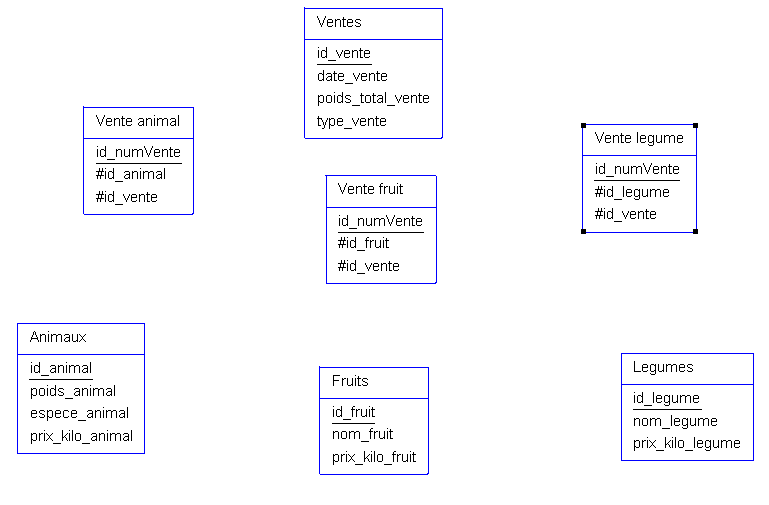

Enoncé : 
[énoncé exerrcice](../Exercice/exercice_agriculteur.docx)

MCD :


MLD :

 

MPD :

Ventes (<u>id_vente</u>, date_vente, poids_total_vente, type_vente)

Animaux (<u>id_animal</u>, poids_animal, espece_animal, prix_kilo_animal)

Fruits (<u>id_fruit</u>, nom_fruit, prix_kilo_fruit)

Legumes (<u>id_legume</u>, nom_legume, prix_kilo_legume)

Vendre_animal (<u>id_animal_vente</u>, #id_animal, #id_vente)

Vendre_fruit (<u>id_fruit_vente</u>, #id_vente, #id_fruit)

Vendre_legume (<u>id_legume_vente</u>, #id_vente, #id_legume)

Script MySQL :

```SQL
DROP TABLE IF EXISTS Ventes;
CREATE TABLE Ventes (
  id_vente BIGINT AUTO_INCREMENT NOT NULL,
  date_vente DATETIME,
  poids_total_vente FLOAT,
  type_vente ENUM,
  PRIMARY KEY (id_vente)
)
ENGINE=InnoDB;

DROP TABLE IF EXISTS Animaux;
CREATE TABLE Animaux (
  id_animal BIGINT AUTO_INCREMENT NOT NULL,
  poids_animal FLOAT,
  espece_animal ENUM,
  prix_kilo_animal FLOAT,
  PRIMARY KEY (id_animal)
)
ENGINE=InnoDB;

DROP TABLE IF EXISTS Fruits;
CREATE TABLE Fruits (
  id_fruit BIGINT AUTO_INCREMENT NOT NULL,
  nom_fruit_Fruit ENUM,
  prix_kilo_fruit FLOAT,
  PRIMARY KEY (id_fruit)
)
ENGINE=InnoDB;

DROP TABLE IF EXISTS Legumes;
CREATE TABLE Legumes (
  id_legume BIGINT AUTO_INCREMENT NOT NULL,
  nom_legume ENUM,
  prix_kilo_legume FLOAT,
  PRIMARY KEY (id_legume)
)
ENGINE=InnoDB;

DROP TABLE IF EXISTS Vendre_animal;
CREATE TABLE Vendre_animal (
  id_animal BIGINT NOT NULL,
  id_vente BIGINT NOT NULL,
  id_animal_vente_animal BIGINT AUTO_INCREMENT NOT NULL,
  PRIMARY KEY (id_animal_vente)
)
ENGINE=InnoDB;

DROP TABLE IF EXISTS Vendre_fruit;
CREATE TABLE Vendre_fruit (
  id_fruit_vente BIGINT AUTO_INCREMENT NOT NULL ,
  id_fruit BIGINT NOT NULL,
  id_vente BIGINT NOT NULL,
  PRIMARY KEY (id_fruit_vente)
)
ENGINE=InnoDB;

DROP TABLE IF EXISTS Vendre_legume;
CREATE TABLE Vendre_legume (
  id_legume_vente BIGINT AUTO_INCREMENT NOT NULL, id_legume BIGINT NOT NULL,
  id_vente BIGINT NOT NULL,
  PRIMARY KEY (id_legume_Vente)
)
ENGINE=InnoDB;

DROP TABLE IF EXISTS Ventes;
CREATE TABLE Ventes (
  id_vente BIGINT AUTO_INCREMENT NOT NULL,
  date_vente DATETIME,
  poids_total_vente FLOAT,
  type_vente VARCHAR(255),
  PRIMARY KEY (id_vente)
)
ENGINE=InnoDB;

DROP TABLE IF EXISTS Animaux;
CREATE TABLE Animaux (
  id_animal BIGINT AUTO_INCREMENT NOT NULL,
  poids_animal FLOAT,
  espece_animal VARCHAR(255),
  prix_kilo_animal FLOAT,
  PRIMARY KEY (id_animal)
)
ENGINE=InnoDB;

DROP TABLE IF EXISTS Fruits;
CREATE TABLE Fruits (
  id_fruit BIGINT AUTO_INCREMENT NOT NULL,
  nom_fruit_Fruit VARCHAR(255),
  prix_kilo_fruit FLOAT,
  PRIMARY KEY (id_fruit)
)
ENGINE=InnoDB;

DROP TABLE IF EXISTS Legumes;
CREATE TABLE Legumes (
  id_legume BIGINT AUTO_INCREMENT NOT NULL,
  nom_legume VARCHAR(255),
  prix_kilo_legume FLOAT,
  PRIMARY KEY (id_legume)
)
ENGINE=InnoDB;

DROP TABLE IF EXISTS Vendre_animal;
CREATE TABLE Vendre_animal (
  id_animal BIGINT NOT NULL,
  id_vente BIGINT NOT NULL,
  PRIMARY KEY (id_animal, id_vente)
)
ENGINE=InnoDB;

DROP TABLE IF EXISTS Vendre_fruit;
CREATE TABLE Vendre_fruit (
  id_fruit BIGINT NOT NULL,
  id_vente BIGINT NOT NULL,
  PRIMARY KEY (id_fruit, id_vente)
)
ENGINE=InnoDB;

DROP TABLE IF EXISTS Vendre_legume;
CREATE TABLE Vendre_legume (
  id_legume BIGINT NOT NULL,
  id_vente BIGINT NOT NULL,
  PRIMARY KEY (id_legume, id_vente)
)
ENGINE=InnoDB;

ALTER TABLE Vendre_animal
ADD CONSTRAINT FK_Vendre_animal_id_vente FOREIGN KEY (id_vente) REFERENCES Ventes (id_vente),
ADD CONSTRAINT FK_Vendre_animal_id_animal FOREIGN KEY (id_animal) REFERENCES Animaux (id_animal);

ALTER TABLE Vendre_fruit
ADD CONSTRAINT FK_Vendre_fruit_id_vente FOREIGN KEY (id_vente) REFERENCES Ventes (id_vente),
ADD CONSTRAINT FK_Vendre_fruit_id_fruit FOREIGN KEY (id_fruit) REFERENCES Fruits (id_fruit);

ALTER TABLE Vendre_legume
ADD CONSTRAINT FK_Vendre_legume_id_vente FOREIGN KEY (id_vente) REFERENCES Ventes (id_vente),
ADD CONSTRAINT FK_Vendre_legume_id_legume FOREIGN KEY (id_legume) REFERENCES Legumes (id_legume); 
```