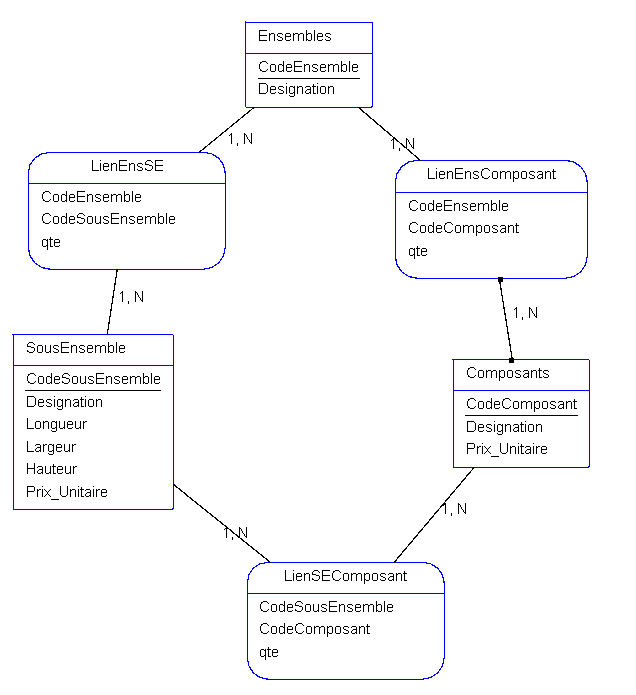
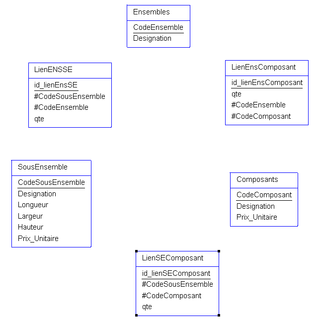

# Exercice Elément

## Enoncé

[Enoncé exercice](./Exercice_2.docx)

## MCD



## MLD



## MPD
Ensembles(<u>CodeEnsemble</u>, Designation)

LienENSSE(<u>idw_lienEnsSE</u>, #CodeSousEnsemble, #CodeEnsemble, qte)

LienEnsComposant(<u>id_lienEnsComposant</u>, #CodeEnsemble, #CodeComposant, qte)

SousEnsemble(<u>CodeSousEnsemble</u>, Designation, Longueur, Largeur, Hauteur, Prix_unitaire)

LienSEComposant(<u>id_lienSEComposant</u>, #CodeSousEnsemble, #CodeComposant, qte)

Composants(<u>CodeComposant</u>, Designation, Prix_unitaire)

Script sous MySQL
```SQL
DROP TABLE IF EXISTS Ensembles;
CREATE TABLE Ensembles (
  CodeEnsemble BIGINT AUTO_INCREMENT NOT NULL,
  Designation_Ensembles VARCHAR(255),
  PRIMARY KEY (CodeEnsemble)
)
ENGINE=InnoDB;

DROP TABLE IF EXISTS SousEnsemble;
CREATE TABLE SousEnsemble (
  CodeSousEnsemble BIGINT AUTO_INCREMENT NOT NULL,
  Designation_SousEnsemble VARCHAR(255),
  Longueur_SousEnsemble FLOAT,
  Largeur_SousEnsemble FLOAT,
  Hauteur_SousEnsemble FLOAT,
  Prix_Unitaire_SousEnsemble FLOAT,
  PRIMARY KEY (CodeSousEnsemble)
)
ENGINE=InnoDB;

DROP TABLE IF EXISTS Composants;
CREATE TABLE Composants (
  CodeComposant BIGINT AUTO_INCREMENT NOT NULL,
  Designation_Composants VARCHAR(255),
  Prix_Unitaire_Composants FLOAT,
  PRIMARY KEY (CodeComposant)
)
ENGINE=InnoDB;

DROP TABLE IF EXISTS LienEnsSE;
CREATE TABLE LienEnsSE (
  CodeEnsemble BIGINT NOT NULL,
  CodeSousEnsemble BIGINT NOT NULL,
  qte_LienEnsSE INT,
  PRIMARY KEY (CodeEnsemble, CodeSousEnsemble)
)
ENGINE=InnoDB;

DROP TABLE IF EXISTS LienEnsComposant;
CREATE TABLE LienEnsComposant (
  CodeEnsemble BIGINT NOT NULL,
  CodeComposant BIGINT NOT NULL,
  qte_LienEnsComposant INT,
  PRIMARY KEY (CodeEnsemble,CodeComposant)
)
ENGINE=InnoDB;

DROP TABLE IF EXISTS LienSEComposant;
CREATE TABLE LienSEComposant (
  CodeComposant BIGINT NOT NULL,
  CodeSousEnsemble BIGINT NOT NULL,
  qte_LienSEComposant INT,
  PRIMARY KEY (CodeComposant, CodeSousEnsemble)
)
ENGINE=InnoDB;

ALTER TABLE LienEnsSE
ADD CONSTRAINT FK_LienEnsSE_CodeEnsemble
FOREIGN KEY (CodeEnsemble)
REFERENCES Ensembles (CodeEnsemble);

ALTER TABLE LienEnsSE 
ADD CONSTRAINT FK_LienEnsSE_CodeSousEnsemble
FOREIGN KEY (CodeSousEnsemble)
REFERENCES SousEnsemble (CodeSousEnsemble);

ALTER TABLE LienEnsComposant
ADD CONSTRAINT FK_LienEnsComposant_CodeEnsemble
FOREIGN KEY (CodeEnsemble)
REFERENCES Ensembles (CodeEnsemble);

ALTER TABLE LienEnsComposant
ADD CONSTRAINT FK_LienEnsComposant_CodeComposant
FOREIGN KEY (CodeComposant)
REFERENCES Composants (CodeComposant);

ALTER TABLE LienSEComposant
ADD CONSTRAINT
FK_LienSEComposant_CodeComposant
FOREIGN KEY (CodeComposant)
REFERENCES Composants (CodeComposant);

ALTER TABLE LienSEComposant
ADD CONSTRAINT FK_LienSEComposant_CodeSousEnsemble
FOREIGN KEY (CodeSousEnsemble)
REFERENCES SousEnsemble (CodeSousEnsemble); 
```