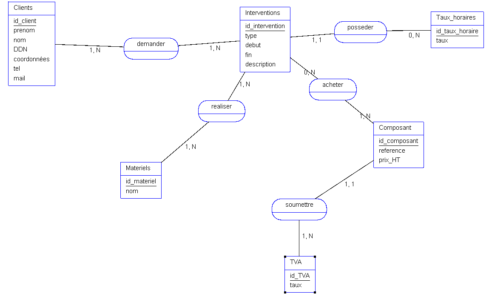
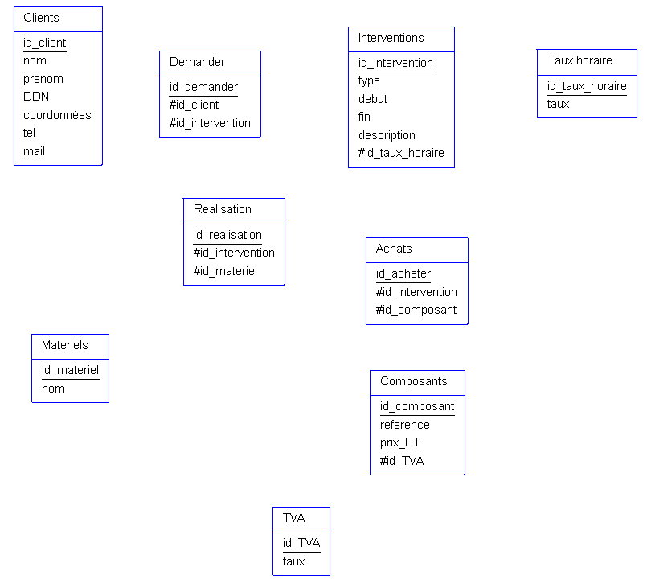

# Exercice entreprenariat

## Enoncé

[Enoncé exercise](./Exercice_3.docx)

## Dictionnaire de données

| Nom data | format | longueur | type (élémentaire/calculé) | règle de calcul | règle de gestion | source |
| --- | --- | --- | --- | --- | --- | --- |
| coordonnée client | varchar | 255 | élémentaire | | | table client |
| prénom client | varchar | 255 | élémentaire | | | table client |
| nom client | varchar | 255 | élémentaire | | | table client |
| DDN client | date |  | élémentaire | | | table client |
| tel client | varchar | 255 | élémentaire | | | table client |
| mail client | varchar | 255 | élémentaire | | | table client |
| nom matériel | varchar | 255 | élémentaire | | | table materiel |
| type d'intervention | varchar | 255 | élémentaire | | | table intervention |
| taux horaire | float | | élémentaire | | | table taux_horaire |
| description intervention | varchar | 255 | élémentaire | | | table intervention |
| début intervention | datetime | 255 | élémentaire | | | table intervention |
| fin intervention | datetime | 255 | élémentaire | | | table intervention |
| durée intervention | datetime | 255 | calculé | différence entre début et fin d'intervention | fin intervention - début intervention | table intervention |
| RefComposant | alphanuméric | 255 | élémentaire |  |  | table composant |
| Prix Composant HT | float | | élémentaire |  |  | table composant |
| Prix Composant TTC | float | | calculé | Prix HT soumis à la TVA | Prix HT * TVA | table composant |
| Taux TVA | float | | élémentaire | |  | table TVA |

## MCD



## MLD



## MPD

Clients(<u>id_client</u>, nom, prenom, DDN, coordonées, tel, mail)

Demande(<u>id_demander</u>, #id_client, #id_intervention)

Interventions(<u>id_intervention</u>, type, debut, fin, description, #id_taux_horaire)

Taux horaire(<u>id_taux_horaire</u>, taux)

Realisation(<u>id_realisation</u>, #id_intervention, #id_materiel)

Achats(<u>id_acheter</u>, #id_intervention, #id_composant)

Materiels(<u>id_materiel</u>, nom)
Composants(<u>id_composant</u>, reference, prix_HT, #id_TVA)

### Script MySQL
```SQL
DROP TABLE IF EXISTS Clients;
CREATE TABLE Clients (
  id_client BIGINT AUTO_INCREMENT NOT NULL,
  prenom_Clients VARCHAR(255),
  nom_Clients VARCHAR(255),
  DDN_Clients DATE,
  coordonnées_Clients VARCHAR(255),
  tel_Clients VARCHAR(255),
  mail_Clients VARCHAR(255),
  PRIMARY KEY (id_client)
)
ENGINE=InnoDB;

DROP TABLE IF EXISTS Interventions;
CREATE TABLE Interventions (
  id_intervention BIGINT AUTO_INCREMENT NOT NULL,
  type_Interventions VARCHAR(255),
  debut_Interventions DATETIME,
  fin_Interventions DATETIME,
  description_Interventions VARCHAR(255),
  id_taux_horaire BIGINT,
  PRIMARY KEY (id_intervention)
)
ENGINE=InnoDB;

DROP TABLE IF EXISTS Composant;
CREATE TABLE Composant (
  id_composant BIGINT AUTO_INCREMENT NOT NULL,
  reference_Composant VARCHAR(255),
  prix_HT_Composant FLOAT,
  id_TVA BIGINT,
  PRIMARY KEY (id_composant)
)
ENGINE=InnoDB;

DROP TABLE IF EXISTS TVA;
CREATE TABLE TVA (
  id_TVA BIGINT AUTO_INCREMENT NOT NULL,
  taux_TVA FLOAT,
  PRIMARY KEY (id_TVA)
)
ENGINE=InnoDB;

DROP TABLE IF EXISTS Materiels;
CREATE TABLE Materiels (
  id_materiel BIGINT AUTO_INCREMENT NOT NULL,
  nom_Materiels VARCHAR(255),
  PRIMARY KEY (id_materiel)
)
ENGINE=InnoDB;

DROP TABLE IF EXISTS Taux_horaires;
CREATE TABLE Taux_horaires (
  id_taux_horaire BIGINT AUTO_INCREMENT NOT NULL,
  taux FLOAT,
  PRIMARY KEY (id_taux_horaire)
)
ENGINE=InnoDB;

DROP TABLE IF EXISTS demander;
CREATE TABLE demander (
  id_client BIGINT NOT NULL,
  id_intervention BIGINT NOT NULL,
  PRIMARY KEY (id_client, id_intervention)
)
ENGINE=InnoDB;

DROP TABLE IF EXISTS realiser;
CREATE TABLE realiser (
  id_intervention BIGINT NOT NULL,
  id_materiel BIGINT NOT NULL,
  PRIMARY KEY (id_intervention, id_materiel)
)
ENGINE=InnoDB;

DROP TABLE IF EXISTS acheter;
CREATE TABLE acheter (
  id_intervention BIGINT NOT NULL,
  id_composant BIGINT NOT NULL,
  PRIMARY KEY (id_intervention,  id_composant)
)
ENGINE=InnoDB;

ALTER TABLE Interventions
ADD CONSTRAINT FK_Interventions_id_taux_horaire FOREIGN KEY (id_taux_horaire)
REFERENCES Taux_horaires (id_taux_horaire);

ALTER TABLE Composant
ADD CONSTRAINT FK_Composant_id_TVA FOREIGN KEY (id_TVA)
REFERENCES TVA (id_TVA);

ALTER TABLE demander
ADD CONSTRAINT FK_demander_id_client FOREIGN KEY (id_client)
REFERENCES Clients (id_client);

ALTER TABLE demander
ADD CONSTRAINT FK_demander_id_intervention FOREIGN KEY (id_intervention)
REFERENCES Interventions (id_intervention);

ALTER TABLE realiser
ADD CONSTRAINT FK_realiser_id_intervention FOREIGN KEY (id_intervention)
REFERENCES Interventions (id_intervention);

ALTER TABLE realiser
ADD CONSTRAINT FK_realiser_id_materiel FOREIGN KEY (id_materiel)
REFERENCES Materiels (id_materiel);

ALTER TABLE acheter
ADD CONSTRAINT FK_acheter_id_intervention FOREIGN KEY (id_intervention) REFERENCES Interventions (id_intervention);

ALTER TABLE acheter
ADD CONSTRAINT FK_acheter_id_composant FOREIGN KEY (id_composant)
REFERENCES Composant (id_composant); 
```