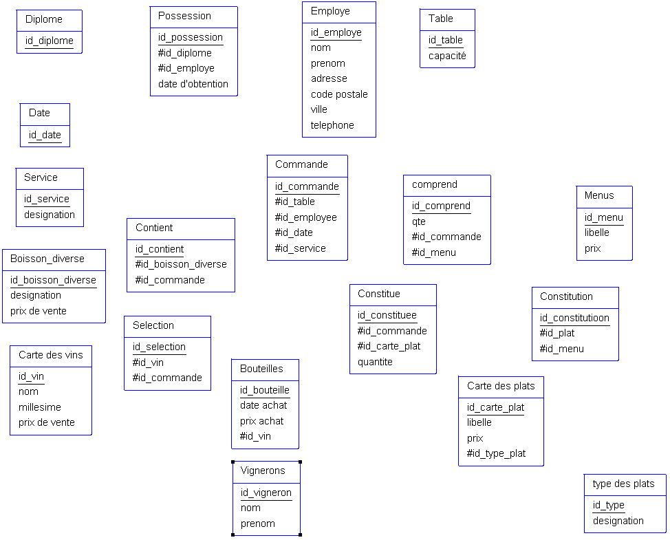

# GIT 

## Introduction 

Git un est logiciel de versionning permettant de tracer les versions des projets et d'avoir des dépôts dit locals et distants afin de faciliter le travail en équipe. 

## Les branches 

Les branches sont une partie importantes de **GIT**.
Il faut comprendre que GIT est donc un outil de versionning on peut donc l'imager tel qu'une ligne temporelle (branche). 


Avec cet outil on va donc pouvoir agir sur notre ligne temporelle en revenant dans le temps, en créant des lignes temporelles différentes qui rejoindront plus tard notre ligne principale.

Chaque point où nous allons pouvoir voyager dans le temps sont des commit. 

Chaque projet va avoir une ligne temporelle pricipale (branche) nommée **main** mais on aura plusieurs lignes temporelle, plusieurs branches plus tard (souvent une par feature, fix, modifications, ...)

Pour créer une branche on utilisera la commande `git branch <nom-de-branche>`. Pour ensuite aller sur la branche que l'on vient de créer on entre la commande `git checkout <nom-de-la-branche>`.
A partir de ce moment, toutes les actions réalisés sur cette branche seront seulement présent sur cette branches (modifications des fichiers, commit, ...)

### Quelques commandes pour les branches

```sh
git branch <name-branch>            #Créer un branche
git checkout <name-branch>          #Se placer sur la branche
git branch -D <name-branch>         #Supprime la branche
git branch -m <old-name> <new-name> #Renomme la branche
```

**Remarques**

Les modifications des fichiers doivent être enregistrer avant de passer d'une branche à l'autre ou elles doivent être mise de côté (plusieurs commandes existent pour cela telle que `git stash`)

### Les branches et les dépôts distants

Lorsque l'on a fait des modifications sur une une branche nous allons sauvegarder nos données et les pousser vers le dépôt distant. 

Nous avons plusieurs possibilité pour cela mais nous allons faire la plus facilement maintenable.

- Il faut commencer par lié la branche et pour cela on va utiliser la commande suivante : 
```sh
git branch --set-upstream-to=ModelisationData/<branch> <branche-locale>
```

Ainsi une fois sur notre branche et que nous aurons commiter nous n'aurons plus qu'à faire `git push`.

# Les commandes de bases
## Instanciation d'un projet GIT
### Init
```sh
git init
```
Cette commande permet d'instancier un dépôt GIT lorsqu'on est dans notre répertoire de notre projet. 
Cela va générer un répertoire <b>.git</b>

Si on ne veut plus que notre répertoire soit un projet git, alors il suffit de supprimer le répertoire <b>.git</b>

### Remote
```sh
git remote add <name> <url>
```
Cette commande permet de lier un dépôt distant à un dépôt local.

Exemple ici nous avons instancié un projet donc un dépôt git.
Au sein de github (ça peut être gitlab ou autre serveur de partage distant du même type), nous instancions un nouveau repertoire et nous lui donnons donc un nom :

Dans notre cas **DataModelisationClass**

Pour lier donc pour dépôt local à mon distant se situant sur Github j'entre la commande suivante : 
```sh
git remote add ModelisationData https://github.com/AlexisCro/DataModelisationClass.git
```

### Clone

Il se peut que l'on veuille récupérer un dépôt distant d'une équipe ou que nous ayons créé en premier le dépôt distant. Dans ce cas nous utiliserons 
```sh
git clone <url>
```
Pour cela on se place dans un répertoire qui sera celui de notre projet et on entre la commande cité ci-dessus. 

Le répertoire distant et tout les fichiers contenu dedans seront importés en local. 

## Status/Add/Commit/Push
### Status
Afin de connaitre le status de nos fichiers, donc si on a des modifications qui ont été effectuées et que nous n'avons pas enregistrer nous pouvons savoir quels fichiser cela concerne grâce à 
```sh
git status
```

En <em style="color:red;">rouge</em> les fichies non indexer seront affichés. 

En <em style="color:green;">vert</em> les fichiers indexés. 

Si un fichier n'est pas affiché c'est qu'il n'a pas eu de modification depuis le dernier commit (enregistrement).

### Indexer

Il y a trois étapes à connaître afin de pouvoir enregistrer les modifications apportés à nos fichiers. 

La première consiste à indexer (stage) et pour cela on utilise la commande 
```sh
git add
```

Cette commande prend différentes options.

```sh
git add . # index tout les fichiers ayant eu des modifications
git add <file_name> # index le fichier spécifier
git add -p # permet d'indexer de façon intéractive tout en affichant les aperçus avant/après
```

### Commit

Après avoir indexer nos fichiers il faut les sauvegarder on dit alors qu'on commit nos fichiers. 

Cela crée un point de sauvegarde dans notre branche (notre ligne temporelle de notre projet).

La commande est la suivante :
```sh
git commit
```

Cela ouvrira un éditeur de texte de type vim pour donner un titre à notre commit. 

Pour ne pas passer par l'éditeur vim utiliser l'option <b>-m</b>.

```sh
git commit -m "titre de mon commit"
```

### Push

Enfin pour mettre à jour notre dépôt distant il faut alors push (pousser) nos données. 

```sh
git push <name>
```
Ici name sera remplacé par ModelisationData.

Si nous avons récupérées notre branches à partir d'un dépôt distant alors il peut ne pas y avoir besoin de spécifier le nom dans cette commande.

Notre dépôt distant est alors à jour avec notre dépôt local :v: :+1:

### Rebase 

Avec la commande `git rebase` nous pouvons, comme son nom l'indique, rebaser nos commit. 

Concrètement lorsque nous créons une nouvelle branche celle-ci est créée à partir d'un commit qui sera le commit racine de cette nouvelle branche. Cependant si nous sommes plusieurs à travailler sur un projet un collègue a pu merger une de ses branches plus tard dans la brache principale. Pour avoir notre branche à jour avec le nouveau code injecté dans la branche principale nous allons rebase notre branche avec la principale.

Pour cela supposons que notre branche n'est plus à jour avec la branche main, nous voulons donc rebaser notre branche. Il faut donc entrer les commandes suivantes :
```sh
git branch checkout <ma-branche>
git rebase main
```
Avec `checkout` nous nous plaçons sur notre branche à rebaser puis nous rebasons notre branche sur main afin que celle-ci soit à jour. 

Il existe également le rebase intéractif permettant notamment de ré-arranger nos commit au sein d'une branche 

Pour cela on place l'argument -i derrière la commande `git rebase` et on ajoute le SHA du commit que l'on récupère via la commande `git log`.

Prenons donc un exemple pour faciliter l'explication. 

Dans un premier temps on doit récupérer le SHA du commit (son identifiant).
Entrons donc la commande `git log`



Nous voyons donc plusieurs chose via cette commande :
- la première ligne en <em style="color:green;">vert</em> nous avons le mot commit puis son SHA et c'est ce que nous allons récupérer pour le rebase intéractif. 
- L'autheur
- La date du commit
- le message du commit

Maintenant que nous avons récupéré notre SHA nous allons pouvoir utiliser `git rebase -i`

Entrons donc la commande 
```sh
git rebase -i <SHA>
# Par exemple
git rebase -i a686609671ebdd31c4f24aef00d0f2b1443836b2
```
Voici ce que nous obtenons


**Remarque**

Tout se passe dans un editeur tel que vim, il faut donc connaître les actions telles que :
- i pour insert
- wq pour write and quit 

Chaque lignes précédées de pick est en réalité un commit. Puis nous avons le message du commit.

On observe qu'il y a ensuite plusieurs options comme 'r', 's' etc. Il suffit donc de remplacer pick par la lettre clé pour réaliser l'action souhaitée. 

Donc si je veux changer le message d'un commit je remplace alors pick du commit souhaité par 'r'.
