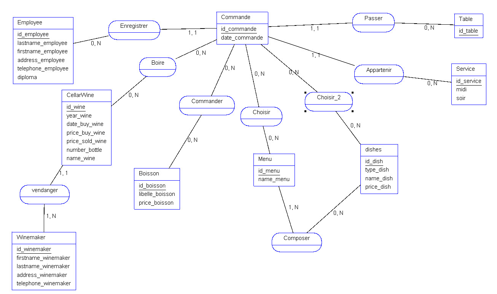
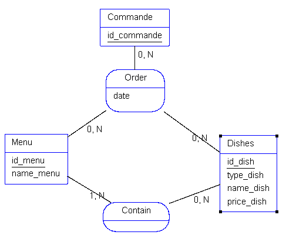
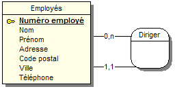
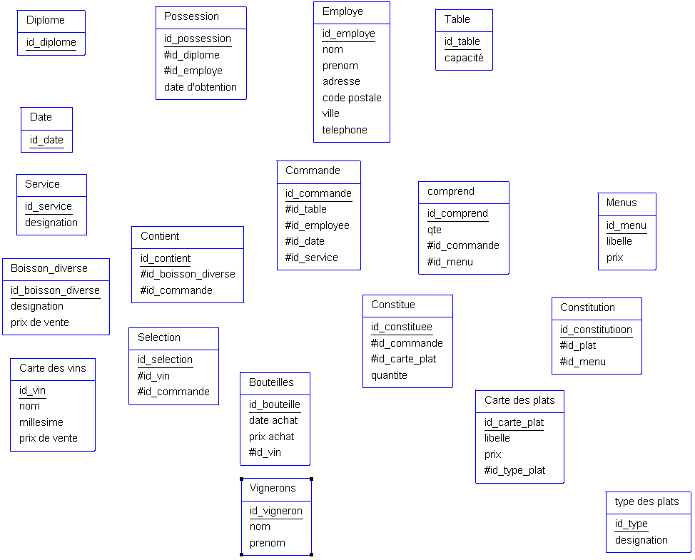

# Modelisation de donnée (Merise, MLD, MCD, MPD)

## Merise
### Introduction

C'est une méthode de modélisation de données.

Merise est un acronyme : Méthode d'Etude et de Réalisation Informatique pour les Systèmes d'Entreprise. 

Elle se caractérise par trois points clés:
  - une approche dite systémique :

    transformation des processus de l'entreprise en système d'information 

  - une séparation des données et des traitements
  - une approche nivelée

### L'approche systémique

#### Définitions
 - Système de pilotage :

    Les preneurs de décisions (patrons, cadres, managers, ...)

 - Système d'information :

    Les employers de l'entreprise.

 - Le système opérant :
    
    Il est composé de l'ensemble des acteurs produisant les données du système d'information

### La séparation des donnees et des traitements

La séparation des données et des traitements permet de séparer les données du système d'information et les traitements effectuées sur les données. 

Cette démarche de fait en 3 étapes :
- L'analyse des flux : on analyse les flux d'informations entre les acteurs du système d'information et les acteurs du système opérant
- L'étude des documents interne (factures, bon de livraison, ...)
- L'étude des documents externes (fournisseurs, clients, ...)

Les différents types d'informations :
- les infos de bases ou élémentaires : ce sont les données de base du système d'information. 
- les infos calculées : ce sont les données calculées à partir des données de base
- les traitements ou les fonctions (actions) : ce sont les traitements effectuées sur les données de base pour obtenir les données calculées. 

### Niveau conceptuel
Permet de modéliser les données de l'entreprise. 
On utilisera le modèle conceptuel de données **(MCD)** pour modéliser les données de l'entreprise et le MCT pour modéliser les traitements de ces données.

### Niveau organisationnel
Il va permettre d'intégrer à l'analyse précédente toutes les notions de temporalités, chronologie des opérations, de contraintes. 

On va utiliser le modèle organisationnel des traitememnts **(MOT)** et le modèle organisationnel des données **(MOD)** pour modéliser les traitements.

A partir des données recueillis au niveau conceptuel on se pose ces questions : 
- **Quand** les traitements sont-ils effectués ? 
- **Où** les traitements sont-ils effectués ? 
- **Qui** effectue les traitements ?

### Le niveau logique

Le niveau logique va permettre de modéliser les data de l'entreprise en utilisant le **MLD** et les traitements de l'entreprise en utilisant le **MLT**

Le **MLD** est indépendant des languages de prog et **SGBD**

On répond à la question **Avec quoi** les traitements sont effectués ?

### Le niveau physique

Il s'agit dde l'organisation réelle des data. 

On va utiliser le modèle physique de data **MPD** et le modèle physique des traitements **MPT**

On répond à la question **Commment** on effectue les traitements ?

### **Resumé**
Nous avons donc 4 niveaux
- Conceptuel
- Organisationnel
- Logique
- Physique

### Des données aux dépendances fonctionnelles

Pour être intégrées dans un système d'information, les données doivent être triées et organisées. On va souvenat tenter de les classer par type de données :
- string
- alphanum
- integer, float
- date
- boolean

### Création d'un dictionnaire de data

[Exercice modelisation donnée facture](./Exercice/dictionnaire_data.md)

### Les dépendances fonctionnelles

Une dépendence est une relation entre deux attributs d'une table. Elle permet de définir une relation de dépendance entre deux attriibuts d'une table. 

#### Exercice
Elaborer un MCD à partir d'un dictionnaire de données.
 
[Enoncer exercice](./Exercice/image-14.png)

**Remarque**
Il faudrait utiliser une relation ternaire au niveau de Menu / Dishes / Commande tel que :

#### Quelques définitions 
Propriétés : sont les info de base d'un SI

Entité : c'est une table

Relation : définis par des verbes d'actions  

Cardinalité : 1.N, N.N, 0.N, 0.1, 1.1

Dépendence fonctionnelle : c'est une relation entre 
 attributs d'une table. Elle permet de définir uen relation de dependance entre 2 attributs.

  Syntaxe :
  - Numéro adhérent (Nom, prenom, code postale, ville)

Dependence fonctionnelle composee : Elle fera intervenir plus de un attribut côté source par exemple pour une donnée qui est le résultat d'une combinaison de table. 

  Exemple : 
  - pour le tour de France si on veut le temps d'un coureur sur une course il nous faudra le nom et la course donc `(course, coureur) -> (temps)`

Dependence focntionnelle elementaire : C'est lorsqu'un élément ne peut être obtenu seulement par la connaissance de la source. Une dépendence peut etre elementaire et composee ou non. 

Exemple :
  - RefProduit -> LibelleProduit
  - NumCommande RefProduit -> QuantiteCommande
  - <strike>NumCommande RefProduit -> LibelleProduit</strike>

Dependence focntionnelle elementaire directe
Exemple :
  - RefPromo -> NumApprenant -> Nompprenant

Donc c'est une data qui ne peut être atteinte que par le biais d'une data transitoire. 

Une relation porteuse : c'est une relation qui detient des propriétés

contraintes d'integrité fonctionnelle (CIF) : est définis par le fait qu'une des entités de l'association est completement déterminée par la connaissance d'une ou plusieurs entités participantes à l'association. 

Exemple :
  - une salle peut contenir 0 ou N ordinateurs.
  - un ordinateurs existe dans 1.1 salle 
  - une CIF existe donc si il y a une cardinalité 1.1

### MLD 
Modèle Logique de Données. 

#### Cas simple 
Il s'agit de la suite du processus Merise, on se rapproche de la base de données. 

En partant d'un MCD tel que 

Nous arriverons au MLD suivant :

La cardinalité 1.1 ou 0.1 est possédée par une entité forte qui absorbe l'identité de l'autre table et donc possède une clé étrangère. 

#### Cas complexe 
<h5 style="font-size:14px; text-decoration: underline;">(0.n/ 0.n ou 1.n / 1.n)</h5>
Partons du MCD suivant :

Nous aboutirons à ce MLD

Si la cardinalité maximale est n des deux côtés alors la table relationnelle devient une entité ayant pour identifiant une clé composite c'est à dire composé des 2 clés étrangères des tables jointes.

<h5 style="font-size:14px; text-decoration: underline;">Cas d'une relation ternaire</h5>

En partant du MCD suivant :

On obtiendra donc ce MLD :

<h5 style="font-size:14px; text-decoration: underline;">Cas d'une relation reflexive</h5>

Partons donc de ce MCD :

Nous aurons donc ce MLD :

##### Petit exercice pratique :

MLD :

### Les formes normales (FN)
Ensemble de règles pour éviter les anomalies au sein des BDDR.
#### Forme normale 1 (1FN)
Une relation est en premiere forme normale si :
- tous les attributs sont atomiques
- les attributs ne contiennent pas de valeurs repetitives

Exemple:

Clients (NumCli, Nom, Prenom, Adresse, Telephone)

Il faudrait avoir 

Clients (NumCli, Nom, Prenom, Adresse, CP, Ville, Telephone)

### Forme normale 2
- Elle respecte les règles de la première forme 
- les données de doivent pas dépendre d'une partie de clé primaire (clé composite) 

### Forme normale 3
- Respecte les règles de la seconde
- ne contient pas de colonne qui fait référence a un doublon de colonne contenant les mêmes data que dans une autres table

### Diagrammes des flux
Modelise les flux d'informations entre les acteurs du SI et les acteurs du sytème operant

Domaine d'etude : le perimetre d'une activite au sein d'une entreprise

les flux : les informations qui circulent entre les acteurs, representé par une fleche et porte un nom et peut etre numerote 

Quelques regles :
- un flux ne peut pas etre bidirectionnele
- un flux ne doit pas etre reflexif
- on ne represente pas les flux entre les acteurs externes

## UML
Unified Modeling Language

C'est un langage de modelisation de données. 
UML a été normalisé en 1997 par l'OMG (Object Management Group). Son but est de mettre en forme les concepts orientés objjets au travers de diagramme. 

UML propose 13 diagrammes dependants de facon hierearchique et se completant. 

1. Diagrammes statiques : ils permettent de modeliser la structure d'un syst
  - diagramme de class
  - diagramme d'objet
  - diagramme de composants 
  - diagramme de déploiement
  - diagramme de paquetages
  - diagramme de structure composite

2. Diagrammes comportementaux
  - diagramme cas d'usage
  - diagramme etats-transitions
  - diagramme d'activité

3. Diagraammes dynamiques
  - diagramme de sequences
  - diagramme de communication
  - diagramme global d'interaction
  - diagramme de temps 